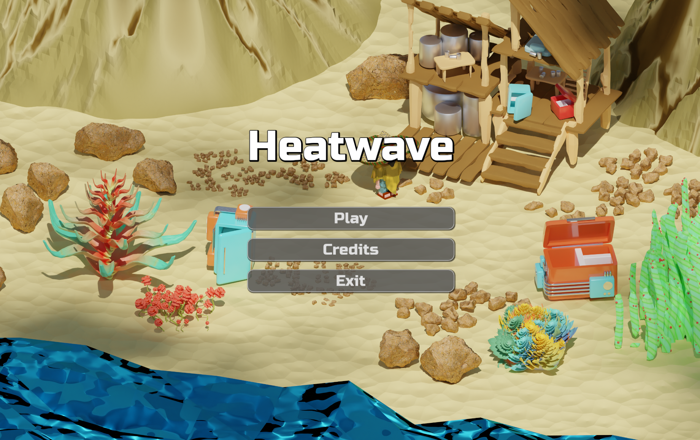
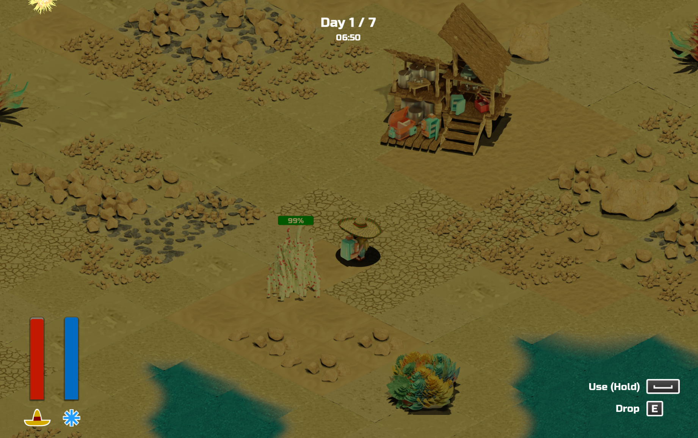
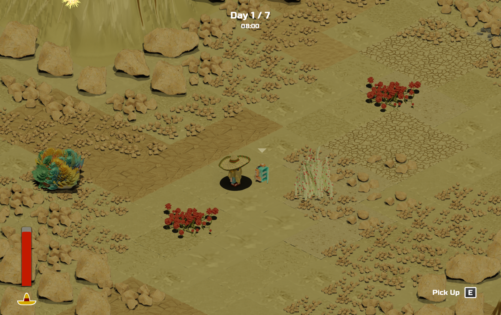
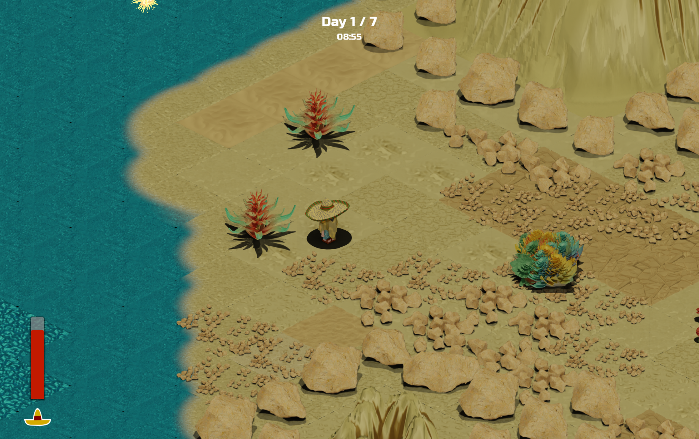
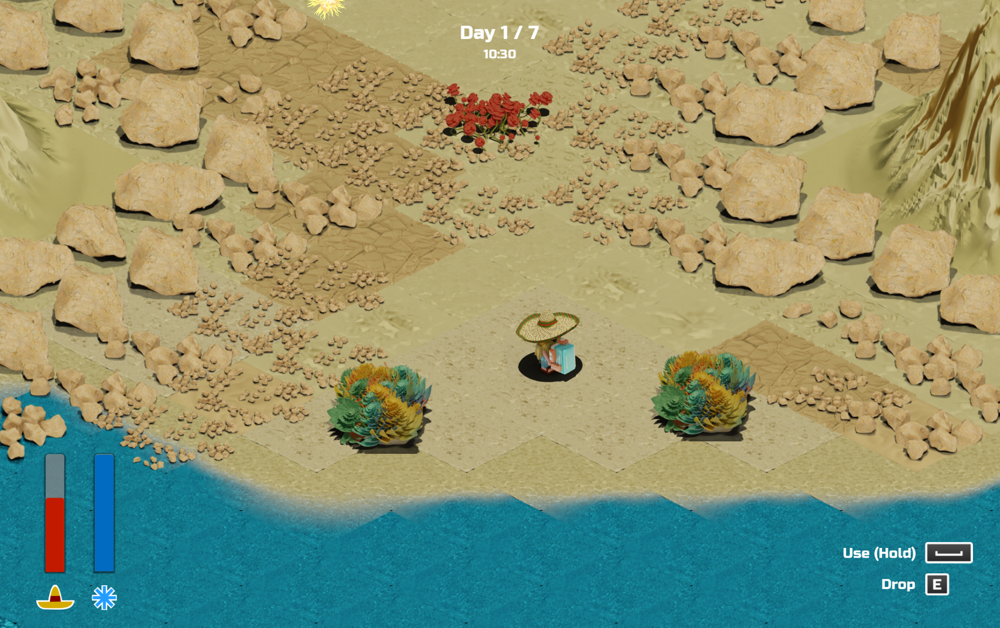

# Heatwave

> Projects, deadlines, white walls, bright white lights, bright screens and a coffee machine... You had enough. After long and hard working months, you decided it is time to go somewhere far, far away from everything and everyone.
 
> A friend of yours, a botanist, had an offer for you. He said: "I will lend you my crib on a distant island. It is a beautiful place surrounded by sea and my beautiful plants. You can have as much rest and drinks as you want there. But only if you take care of my plants! You will have access to my ultra-power-energy-mobile fridges to help you. When empty, just drop them next to the crib and they will refill themselves."
 
> Of course you took the offer, why wouldn't you? Bit of caring for some plants cannot be that hard.
It would be nothing hard... However, you didn't know about a detail that changed everything - the heatwave was coming!

> Stay hydrated and do not lose the plants.

## Info

Playing on a larger screen (e.g. PC) with headphones is recommended!

Made for Hauntaku 2023 game-jam: https://itch.io/jam/hauntaku-2023-summer-jam

Play it on itch.io: https://lovbos.itch.io/heatwave

## Showcase

<table>
  <tr>
    <td colspan="2"></td>
  </tr>
  <tr>
    <td></td>
    <td></td>
  </tr>
  <tr>
    <td></td>
    <td></td>
  </tr>
</table>

## Controls 

| Action                        |Binding               |
|-------------------------------| ---------------------|
| Move                          | Arrow Keys           |
| Drink / Pick Up / Drop        | E                    |
| Use (Hold)                    | Space                |

## Technologies

* Godot Engine (https://godotengine.org/) 4.1.1 (Compatibility renderer): Game development
* Blender (https://www.blender.org/) 3.6.0: Art, Assets, Environment Art, Character and Animation
* Krita (https://krita.org/) 5.1.5: Textures
* LMMS (https://lmms.io/): Music

## Codename: `jagoda-jam`

Word play. In Croatian, "jam" phonetically sounds like the word "džem" meaning "marmalade". "Jagoda" is a fruit (strawberry) from which marmelade is often made.